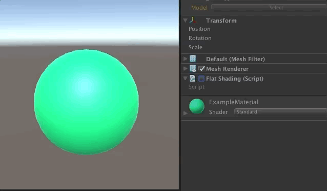

## Flat Shading

Get a flat look with one click, without touching your mesh!

### Features
+ Simple!
+ Uses surface shaders, so it supports all lightning stuff out of the box
+ Cross-platform
+ Easy to integrate it in your own surface shader 

### Motivation

If you create a cube in Unity, you'll get a mesh with 24 vertices, instead of the 8 you'd expect from a normal cube. The additional vertices are added to ensure that each triangle is made of up three vertices with the same normal.

The thing is that, in my case, I wanted to render some text per vertex without having to write extra ugly code to avoid repeated vertices, so I was looking for a solution that would give me a flat-looking cube without the need for extra vertices.

### Usage instructions

The `FlatShading` component switches between the original material and the flat shading one. 